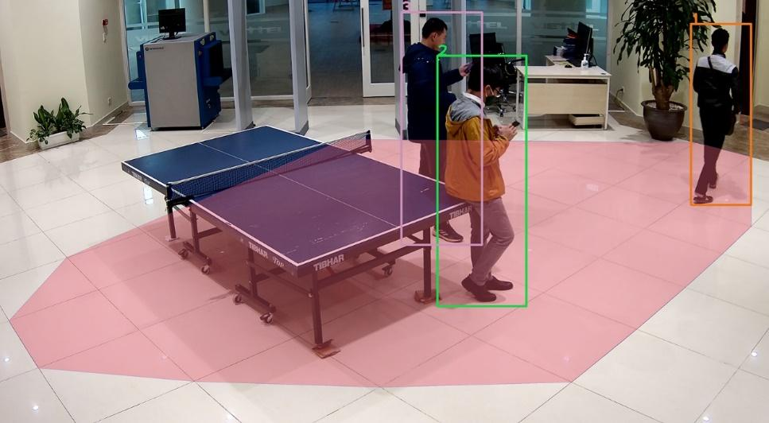
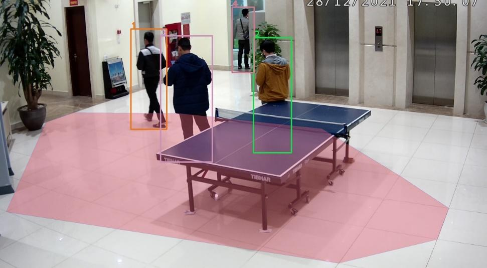
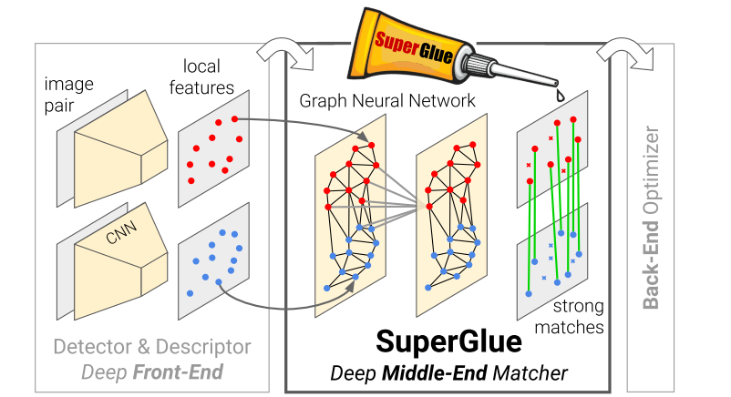

# Overlap Area Estimation
<div align="center">
    
    
</div>

# Overview 
This repo provides our team's solution for the task "Overlap Area Estimation" in the Junction X Hanoi 2023 Hackathon. In this task, we are required to determine the overlapping zone of the cameras in different directions. Check the file [VTX_OVA](VTX_OVA.pdf) for detailed task description, and the file [Submission_Guide](Submission_Guide.pdf) for submission requirements. Our team decide to choose the model [SuperGlue](https://openaccess.thecvf.com/content_CVPR_2020/html/Sarlin_SuperGlue_Learning_Feature_Matching_With_Graph_Neural_Networks_CVPR_2020_paper.html) for matching overlap area among viđeo frames. The model has been pretrained and we simply use it without any training.
<div align="center">
    
</div>

## Built With
<div align="center">
    <a href="https://pytorch.org/">
    
    </a>
    <a href="https://opencv.org/">
    
    </a>
</div>

## Usage
1. Clone the repo
   ```sh
   git clone https://github.com/hieunm44/overlap-area-estimation.git
   cd overlap-area-estimation
   ```
2. Install necessary packages
   ```sh
   pip install -r requirements.txt
   ```
3. Go to this [Google drive storage](https://drive.google.com/drive/folders/1i4v3EOxJzovdWvRTAykOa28dOHRoB6xU?usp=sharing) to download the dataset and put them in the folder `data_btc`.
4. Run the task and write result files
   ```sh
   python3 main.py
   ```
   Result files will be generated in the folder `Next Gen AI` (our team's name), following the required format by the Hackathon organizers. The code runs better if you have GPUs on your system.

## References
* SuperGlue source code: https://github.com/magicleap/SuperGluePretrainedNetwork
* SuperGlue visualizations: https://psarlin.com/superglue/